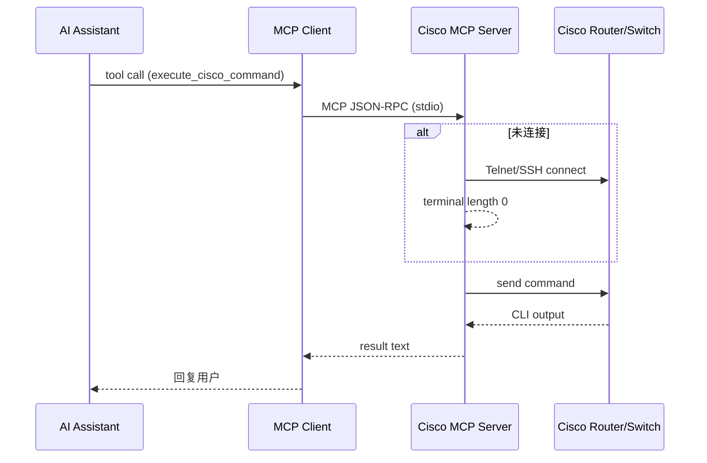

# Cisco MCP Server (v2)

 

一个针对 **Cisco 路由器 / 交换机 / 防火墙** 的 MCP（Model Context Protocol）服务器，可让 ChatGPT、Claude、Amazon Q 等 AI 助手通过 **工具调用** 方式执行命令并进行网络自动化。

> v2 版本特性：
> 1. **设备配置文件** —— 通过 JSON 数组集中管理多台设备，使用 `deviceAlias` 唯一标识。
> 2. **自动建连** —— 调用 `execute_cisco_command` 时若未连接，将自动读取配置并建立 Telnet / SSH 长连接。
> 3. **分页关闭** —— 启动后自动执行 `terminal length 0`，避免 `--More--` 输出停顿。
> 4. **改进的工具集** —— 共 5 个工具：`list_available_devices`、`connect_cisco_device`、`execute_cisco_command`、`disconnect_cisco_device`、`list_connections`。

---
## 目录
1. 快速开始
2. 设备配置文件格式
3. 工具一览 & 调用示例
4. 架构 & 流程
5. 开发与测试
6. FAQ / 常见问题

---
## 1. 快速开始
```bash
# 克隆并安装依赖
git clone https://github.com/very99/cisco-mcp.git
cd cisco-mcp
npm install

# 创建设备文件（详见下一节）
cp example.devices.json cisco-devices.json

# 构建
npm run build

# 运行 MCP Server（传入设备文件路径）
node dist/index.js ./cisco-devices.json
```

在 AI 助手（或任何 MCP Client）中将服务器注册为：
```json
{
  "mcpServers": {
    "cisco-mcp": {
      "command": "node",
      "args": ["/absolute/path/to/dist/index.js", "/absolute/path/to/cisco-devices.json"]
    }
  }
}
```

---
## 2. 设备配置文件格式
`cisco-devices.json` 示例：
```json
[
  {
    "alias": "office-cisco-3750",
    "host": "192.168.4.14",
    "username": "cisco",
    "password": "********",
    "protocol": "telnet"      // 可选："ssh" | "telnet"，默认 ssh
    // "port": 23             // 可选
    // "enablePassword": "***" // 可选
  }
]
```
• **alias** ：必须唯一，后续所有工具均以此为设备标识。  
• **enablePassword** ：若需要进入特权模式，可填写；否则留空。

---
## 3. 工具一览 & 调用示例

| 名称 | 作用 | 关键字段 |
| ---- | ---- | -------- |
| `list_available_devices` | 列出所有已配置的设备（alias/host/protocol）。<br>不清楚 alias 时先调用它。 | 无参数 |
| `connect_cisco_device` | 主动建立长连接；通常不必显式调用，`execute_cisco_command` 会自动建连。| `deviceAlias` |
| `execute_cisco_command` | 执行任意 Cisco 命令（user/enable/config）。若未连接会自动建连。 | `deviceAlias`, `command`, `mode?` |
| `disconnect_cisco_device` | 断开指定设备连接，释放资源。 | `deviceAlias` |
| `list_connections` | 查看当前活动连接及时间戳。 | 无参数 |

### 调用示例（伪代码）
```jsonc
// 1. 如果不知道 alias，可先查询
{"tool": "list_available_devices", "arguments": {} }
// => [{"alias": "office-cisco-3750", "host": "192.168.4.14", "protocol": "telnet"}]

// 2. 直接执行命令（自动建连）
{
  "tool": "execute_cisco_command",
  "arguments": {
    "deviceAlias": "office-cisco-3750",
    "command": "show version",
    "mode": "user"
  }
}
// 返回 IOS 版本信息
```

---
## 4. 架构 & 流程


---
## 5. 开发与测试

```bash
# 本地热重载
npm run dev /path/to/cisco-devices.json

# 单元 + 集成测试
npm test            # 默认测试 office-cisco-3750 & show version
```
测试脚本位于 `scripts/test-office.ts`，可使用：
```bash
npx tsx scripts/test-office.ts ./cisco-devices.json office-cisco-3750
```

目前已经在Cisco 3750 上测试通过，其他设备未测试。

npm test的验证方式是硬编码，未来可以考虑优化。

---
## 6. FAQ / 常见问题

**Q: 如果 execute_cisco_command 提示 alias 未找到？**  
A: 先确认设备已写入配置文件，再调用 `list_available_devices` 查看是否加载成功。

**Q: 需要手动 connect 吗？**  
A: 一般不需要。服务器会在首次执行命令时自动建连。

**Q: Telnet 输出被 `--More--` 卡住？**  
A: 服务器会在连接后发送 `terminal length 0` 关闭分页；若仍遇到问题请确保设备支持该命令。

**Q: 如何安全保存密码？**  
A: 目前示例使用明文 JSON；生产可将密码加密或改用环境变量，并在 `config-loader` 中解密读取。

---
**MIT License**  | © 2024 very99